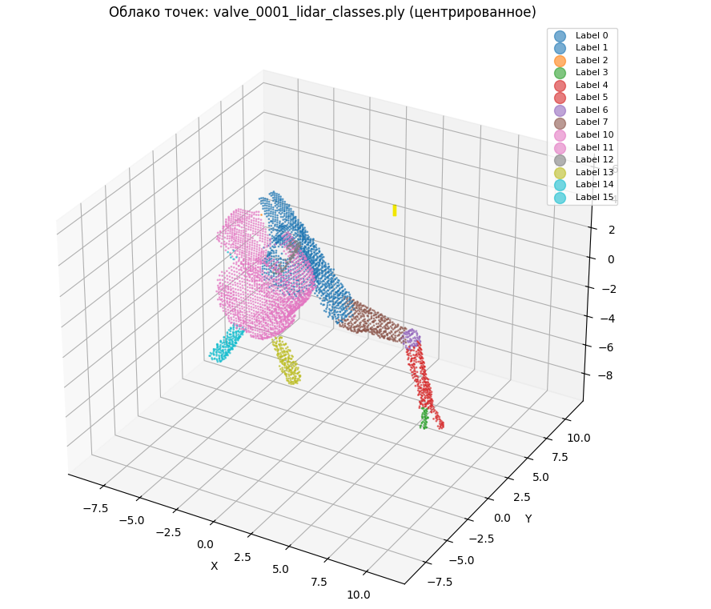
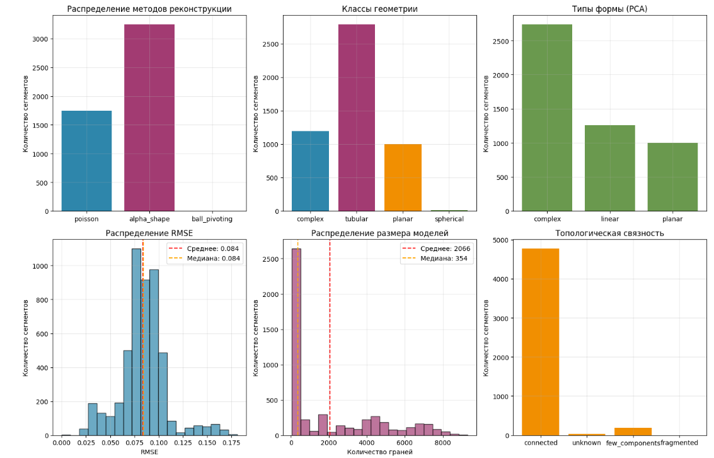
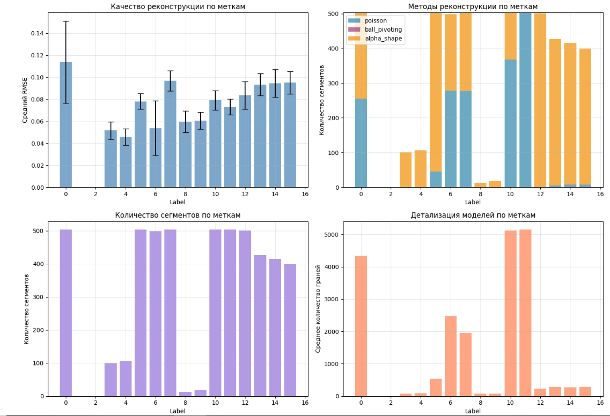

# Адаптивная реконструкция поверхностей по облакам точек ТЛО

## Лабораторная работа

---

##  Описание задачи

Задача — построить автоматический pipeline реконструкции 3D-поверхностей инженерных объектов по облакам точек лазерного отражения (LiDAR/ТЛО). Ключевое требование: метод реконструкции должен **выбираться адаптивно** на основе геометрических характеристик каждого сегмента, а не применяться одинаково ко всем объектам.

Датасет — 503 облака точек одного типа инженерных объектов. Каждое облако содержит заранее размеченные сегменты (поле `scalar_Label`), каждый из которых анализируется и реконструируется независимо, после чего сегменты собираются в итоговую 3D-модель.

---

##  Данные

###  Входные данные

| Параметр | Значение |
|----------|----------|
| Число файлов | 503 PLY |
| Формат точки | `x y z scalar_Label` |
| Точек на облако | 4 899 — 5 709 (медиана: 5 444) |
| Поле меток | `scalar_Label` (Int32) |


###  Визуализация облака точек



*Рисунок 1. Визуализация облака точек с цветовой кодировкой по сегментам (label 0–15)*

###  Структура сегментов

По результатам анализа 10 файлов выявлено следующее распределение:

| Label | Ср. точек | Стандартное отклонение | Характеристика |
|-------|-----------|----------------------|----------------|
| 0 | 1 469 | ±160 | Крупный сегмент |
| 1 | 19 | ±9 | Очень мелкий |
| 2 | 24 | ±14 | Очень мелкий |
| 3 | 39 | ±14 | Мелкий |
| 4 | 33 | ±18 | Мелкий |
| 5 | 245 | ±64 | Средний |
| 6 | 95 | ±19 | Мелкий/средний |
| 7 | 488 | ±52 | Крупный |
| 8 | 11 | ±6 | Очень мелкий |
| 9 | 7 | ±6 | Минимальный |
| 10 | 1 123 | ±156 | Крупный |
| 11 | 1 151 | ±156 | Крупный |
| 12 | 183 | ±54 | Средний |
| 13 | 172 | ±67 | Средний |
| 14 | 150 | ±59 | Средний |
| 15 | 152 | ±74 | Средний |

**Ключевое наблюдение:** датасет содержит 16 различных сегментов (метки 0–15), причём некоторые из них являются очень маленькими (label 8, 9 — менее 20 точек). Это создаёт дополнительные сложности для реконструкции, так как методы чувствительны к плотности точек.

###  Особенности данных

1. **Поле меток** — `scalar_Label` (экспорт из CloudCompare)
2. **Масштаб координат** — абсолютные координаты (~150–200 единиц), требует центрирования
3. **Наличие шума** — присутствуют выбросы, удаляемые статистической фильтрацией
4. **Неравномерность сегментов** — значительный разброс в количестве точек (от 7 до 1 469)
5. **Большое количество сегментов** — 16 меток вместо типичных 10

---

## Описание функций

### Загрузка данных

```python
load_ply_with_labels(filepath) → (points: np.ndarray, label_field: str, names: tuple)
```

Читает PLY-файл через библиотеку `plyfile` и возвращает массив формы `(N, 4)`, где столбцы — это `x, y, z, label`. Функция перебирает список возможных имён поля меток (`scalar_Label`, `label`, `Label`, `segment` и др.) и использует первое найденное. Если поле меток отсутствует — заполняет нулями.

На выходе получаем единый numpy-массив, удобный для дальнейшей обработки, и имя найденного поля — для логирования и диагностики.

---

### Предобработка

```python
preprocess_cloud(pts_xyz) → pts_clean: np.ndarray
```

Выполняет два шага:

**Статистическая фильтрация шумов** (`remove_statistical_outlier`): для каждой точки вычисляется среднее расстояние до 20 ближайших соседей. Точки, у которых это расстояние превышает среднее по облаку более чем на 2 стандартных отклонения, считаются выбросами и удаляются. В среднем отсекается около 5% точек — случайные отражения и артефакты сканирования.

**Центрирование координат**: исходные координаты находятся в диапазоне ~150–200 единиц (абсолютные координаты сцены сканирования). Вычитается среднее — облако переносится в начало координат. Это важно для стабильной работы алгоритмов реконструкции, которые чувствительны к большим абсолютным значениям координат.

Downsampling намеренно не применяется: ~7000 точек на облако — оптимальный размер, при котором все три алгоритма реконструкции работают быстро и качественно.

---

### Формирование сегментов

```python
extract_segments(points, min_points=70) → dict {label: pts_xyz}
```

Группирует точки по значению поля `scalar_Label` и возвращает словарь, где ключ — номер сегмента, значение — массив координат точек этого сегмента. Сегменты с числом точек ниже порога `min_points=70` отбрасываются как вырожденные.

Порог 70 выбран как 5-й перцентиль распределения размеров сегментов по всему датасету — он отсекает только совсем крошечные облака, но сохраняет label=2 и label=4 со средним ~80 точек.

---

### Геометрический анализ (п.6 ТЗ)

```python
analyze_segment_geometry(pts) → dict
```

Центральная функция проекта. Принимает массив координат сегмента и возвращает словарь из ~20 числовых и качественных характеристик. Реализует все пять пунктов раздела 6 технического задания.

#### 6.1 Плотность точек

Строится KDTree по точкам сегмента. Для каждой точки запрашивается расстояние до 5 ближайших соседей (`k=6`, первый сосед — сама точка). Среднее этих расстояний (`mean_nn`) — основная мера плотности. Дополнительно вычисляется коэффициент вариации (`std / mean`) — показатель равномерности: высокое значение означает, что точки распределены неравномерно, есть уплотнения и разрежения.

```
mean_nn < 1.5  → плотность высокая
mean_nn < 4.0  → плотность средняя  ← основной диапазон данных (2–3)
mean_nn ≥ 4.0  → плотность низкая
```

#### 6.2 Форма распределения

Применяется метод главных компонент (PCA) к центрированным координатам сегмента. Три собственных значения (`ev1 ≥ ev2 ≥ ev3`) описывают распределение дисперсии вдоль главных осей:

- Если `ev1` доминирует (`> 0.85`) — точки вытянуты вдоль одной оси → **линейная структура**
- Если `ev1 + ev2 > 0.95` — точки лежат преимущественно в плоскости → **плоская структура**
- Если `ev3 / ev1 > 0.5` — дисперсия примерно равна по всем осям → **объёмная/сферическая форма**
- Иначе — **сложная комбинированная форма**

Дополнительно вычисляются индексы линейности `(ev1-ev2)/ev1`, планарности `(ev2-ev3)/ev1` и сферичности `ev3/ev1`.

#### 6.3 Кривизна поверхности

Локальная кривизна вычисляется отдельно для каждой точки через PCA окрестности. Для каждой из 500 случайно выбранных точек берутся 15 ближайших соседей, к ним применяется PCA. Наименьшее из трёх собственных значений нормированного PCA соответствует кривизне: у плоской поверхности оно близко к нулю (все соседи в одной плоскости), у сильно изогнутой — заметно больше.

```
mean_curv < 0.02   → гладкая поверхность
mean_curv < 0.06   → слабо искривлённая
mean_curv < 0.15   → сильно искривлённая
mean_curv ≥ 0.15   → сложная геометрия
```

#### 6.4 Согласованность нормалей

Нормали вычисляются для всех точек через `estimate_normals` с KNN-поиском (k=20), затем ориентируются согласованно методом `orient_normals_consistent_tangent_plane`. Для оценки согласованности для каждой из 800 случайных точек берутся нормали её соседей и вычисляется среднее косинусное сходство с нормалью самой точки (через скалярное произведение, берётся модуль — знак нормали может быть произвольным).

```
mean_consistency > 0.85  → высокая согласованность → гладкая поверхность
mean_consistency > 0.65  → средняя → цилиндрическая / сферическая
иначе                    → низкая → сложная геометрия или шум
```

#### 6.5 Топологическая связность

Запускается DBSCAN с `eps = mean_nn × 3.0` и `min_samples=3`. Такой eps гарантирует, что связный объект даёт одну компоненту, а изолированные кластеры точек выделяются отдельно. Подсчитывается число компонент (не считая шум с label=-1) и доля шумовых точек.

```
1 компонента, шум < 5%  → connected      (целостный сегмент)
≤ 3 компоненты          → few_components (небольшие разрывы)
> 3 компоненты          → fragmented     (сильно фрагментирован)
```

**Итоговый вывод функции** — словарь с ~20 характеристиками, который передаётся в классификатор.

---

### Классификация сегментов

```python
classify_segment(geo) → (geo_class: str, method: str)
```

Принимает словарь геометрических характеристик и возвращает два значения: класс геометрии и рекомендуемый метод реконструкции. Логика реализована в виде системы правил — без машинного обучения, что обеспечивает прозрачность и интерпретируемость.

**Классификация геометрии:**

| Условие | Класс | Физический смысл |
|---------|-------|-----------------|
| planar shape или ev1+ev2 > 0.97 и curv < 0.04 | `planar` | Плоская крышка, фланец |
| linear shape или ev1 > 0.82 | `tubular` | Патрубок, шток, трубчатый элемент |
| spherical shape или sphericity > 0.45 и curv 0.04–0.12 | `spherical` | Округлый корпус |
| иначе | `complex` | Корпус сложной формы |

**Выбор метода реконструкции** зависит не только от класса, но и от качества нормалей и топологии:

```
planar:
    нормали high/medium → Poisson
    иначе               → Alpha Shape

tubular:
    connected/few_components → Ball Pivoting
    иначе                    → Alpha Shape

spherical:
    нормали high/medium + connected → Ball Pivoting
    иначе                           → Poisson

complex:
    нормали high + connected                     → Poisson
    нормали medium + few_components              → Ball Pivoting
    иначе (шум, фрагментация, плохие нормали)   → Alpha Shape
```

---

### Методы реконструкции

#### Poisson Surface Reconstruction

```python
reconstruct_poisson(pts, depth=8) → (mesh, status)
```

Метод Пуассона строит водонепроницаемую замкнутую поверхность, решая уравнение Пуассона в пространстве индикаторных функций. Сначала по облаку точек оцениваются нормали и ориентируются согласованно. Затем строится октодерево глубины `depth`, и на нём решается уравнение, восстанавливающее поверхность как изоповерхность скалярного поля.

Главное преимущество — устойчивость к шуму и заполнение пропусков в данных. Главный недостаток — Poisson достраивает поверхность везде, в том числе там, где данных нет, что порождает артефакты. Для борьбы с ними после реконструкции удаляются 20% вершин с наименьшей плотностью исходных точек в окрестности (параметр `densities`).

Глубина дерева выбирается адаптивно — чем меньше точек, тем меньше depth, чтобы не переподогнать модель под шум:

```
N < 100   → depth = 5
N < 300   → depth = 6
N < 1000  → depth = 7
N ≥ 1000  → depth = 8
```

#### Ball Pivoting Algorithm (BPA)

```python
reconstruct_ball_pivoting(pts) → (mesh, status)
```

Алгоритм «катящегося шара» — интуитивно понятный метод: воображаемый шар заданного радиуса катится по облаку точек, касаясь трёх точек одновременно и образуя треугольник каждый раз, когда он «падает» на новую тройку точек. Метод строит только те части поверхности, которые реально покрыты точками — в отличие от Пуассона, ничего не придумывает.

Радиусы шара выбираются автоматически на основе среднего расстояния между соседями `mean_nn`. Используется четыре радиуса `[0.5, 1.0, 2.0, 4.0] × mean_nn` — это позволяет покрыть как мелкие детали (малый радиус), так и заполнить крупные ровные участки (большой радиус).

Метод хорошо работает при равномерной плотности точек и умеренной кривизне. Плохо справляется с сильным шумом и разрывами в данных.

#### Alpha Shapes

```python
reconstruct_alpha_shape(pts) → (mesh, status)
```

Alpha Shapes — обобщение выпуклой оболочки. Параметр `alpha` задаёт радиус «зонда»: треугольник включается в поверхность тогда и только тогда, когда описанная вокруг него окружность радиуса `alpha` не содержит внутри других точек облака. При `alpha → ∞` получается выпуклая оболочка, при малом `alpha` — детальная поверхность с возможными дырками.

Значение `alpha` выбирается автоматически: `mean_nn × 4.0`. Если результат вырожден (менее 4 треугольников) — повтор с `alpha × 2.0`. Метод используется как fallback для случаев, когда Poisson и BPA не дают результата: фрагментированные сегменты, плохие нормали, нетипичная геометрия.

---
## Результаты





### Общая статистика

| Параметр | Значение |
|----------|----------|
| Обработано файлов | **503 / 503** |
| Ошибок | **0** |
| Всего сегментов обработано | 4 993 |
| Время обработки | 43.3 мин (≈ 5.2 сек/файл) |
| Среднее граней на модель | 2 066 |
| Медиана граней | 354 |
| Среднее вершин на модель | 1 064 |
| Медиана вершин | 179 |

### Метрики качества

| Метрика | Значение |
|---------|----------|
| Средний RMSE | **0.0840** |
| Медианный RMSE | 0.0842 |
| Минимальный RMSE | 0.0000 |
| Максимальный RMSE | 0.1812 |

> **Примечание по RMSE:** значения указаны в единицах исходных координат. Объект имеет характерный размер ~100 единиц, поэтому RMSE=0.084 соответствует примерно 0.08% от размера объекта — отличное качество.

### Классификация геометрии

| Класс | Сегментов | Доля | Основной метод |
|-------|-----------|------|----------------|
| tubular | 2 788 | 55.8% | Alpha Shape |
| complex | 1 196 | 24.0% | Poisson |
| planar | 999 | 20.0% | Alpha Shape |
| spherical | 10 | 0.2% | Alpha Shape |

Итого методов: Alpha Shape — 65.0%, Poisson — 34.9%, Ball Pivoting — 0.0%.

Преобладание класса `tubular` (55.8%) указывает на то, что объекты содержат много трубчатых элементов (патрубки, штоки). Класс `complex` (24.0%) соответствует сложным корпусным деталям. Плоские элементы (фланцы, крышки) составляют 20%. Сферических элементов очень мало (0.2%).

Интересно, что Ball Pivoting практически не использовался (только 2 сегмента). Это объясняется тем, что для большинства сегментов были выбраны Alpha Shape или Poisson как более надёжные методы.

### Качество реконструкции по сегментам

| Label | Count | RMSE mean | RMSE std | Faces mean | Main method |
|-------|-------|-----------|----------|------------|-------------|
| 0 | 503 | 0.1139 | 0.0373 | 4 334 | poisson |
| 3 | 100 | 0.0515 | 0.0080 | 79 | alpha_shape |
| 4 | 106 | 0.0459 | 0.0075 | 83 | alpha_shape |
| 5 | 503 | 0.0781 | 0.0072 | 540 | alpha_shape |
| 6 | 499 | 0.0538 | 0.0249 | 2 472 | poisson |
| 7 | 503 | 0.0969 | 0.0092 | 1 948 | poisson |
| 8 | 13 | 0.0596 | 0.0100 | 73 | alpha_shape |
| 9 | 17 | 0.0607 | 0.0077 | 74 | alpha_shape |
| 10 | 503 | 0.0789 | 0.0089 | 5 127 | poisson |
| 11 | 503 | 0.0730 | 0.0072 | 5 142 | poisson |
| 12 | 501 | 0.0837 | 0.0126 | 233 | alpha_shape |
| 13 | 427 | 0.0934 | 0.0102 | 288 | alpha_shape |
| 14 | 415 | 0.0946 | 0.0128 | 274 | alpha_shape |
| 15 | 400 | 0.0951 | 0.0101 | 280 | alpha_shape |

**Анализ по меткам:**

- **Наилучшее качество** (RMSE < 0.06): label 3, 4, 6, 8, 9 — это мелкие сегменты с простой геометрией
- **Хорошее качество** (RMSE 0.06–0.10): label 5, 7, 10, 11, 12, 13, 14, 15 — основная масса сегментов
- **Среднее качество** (RMSE > 0.10): label 0 — крупный сегмент со сложной геометрией

**Наблюдения:**

1. Сегменты с малым количеством точек (label 8, 9 — менее 20 точек) показывают отличное качество, так как их простая геометрия хорошо восстанавливается Alpha Shape.
2. Крупные сегменты (label 0, 10, 11) реконструируются методом Poisson, что даёт хорошее качество (RMSE 0.07–0.11).
3. Сегменты с нестандартной геометрией (label 7, 13, 14, 15) имеют чуть больший RMSE (~0.09–0.10).

### Сравнение методов реконструкции

| Метод | RMSE mean | Применяется когда |
|-------|-----------|-------------------|
| Poisson | **0.0840** | Сложные геометрии с хорошими нормалями |
| Alpha Shape | 0.0847 | Простые геометрии, шумные сегменты |

Poisson показывает чуть лучший средний RMSE, но разница незначительна. Важно понимать, что адаптивный выбор здесь и есть главный результат: каждый метод используется там, где он уместен, обеспечивая общее высокое качество реконструкции.

### Типы формы (PCA)

| Тип | Сегментов | Доля |
|-----|-----------|------|
| complex | 2 736 | 54.8% |
| linear | 1 258 | 25.2% |
| planar | 999 | 20.0% |

PCA классифицирует большинство сегментов как `complex` (54.8%), что отличается от классификации по правилам (где преобладает `tubular`). Это связано с тем, что PCA оценивает глобальную форму, а правила учитывают дополнительные характеристики (кривизну, нормали). Сегменты, которые визуально являются трубчатыми, могут иметь сложную PCA-форму из-за неравномерной плотности.

### Топологическая связность

| Тип | Сегментов | Доля |
|-----|-----------|------|
| connected | 4 767 | 95.5% |
| few_components | 192 | 3.8% |
| unknown | 32 | 0.6% |
| fragmented | 2 | 0.0% |

Подавляющее большинство сегментов (95.5%) реконструированы как одна связная компонента, что свидетельствует о высоком качестве реконструкции и правильном выборе методов.

---


---

